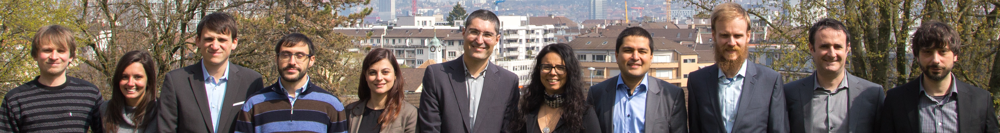
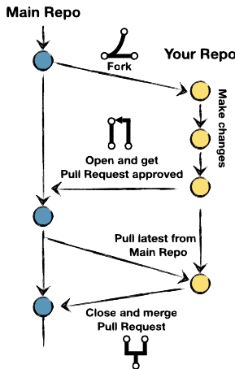
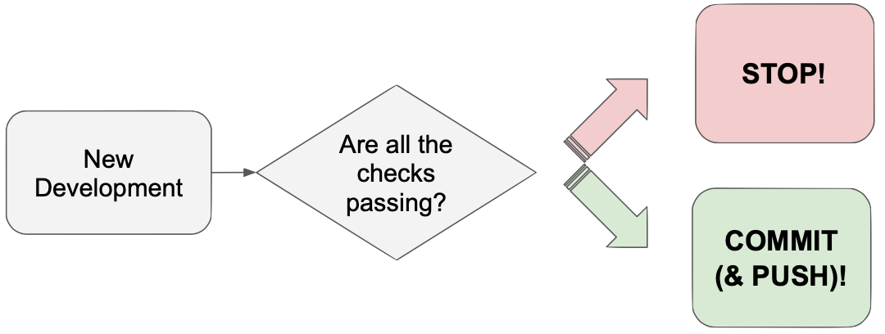
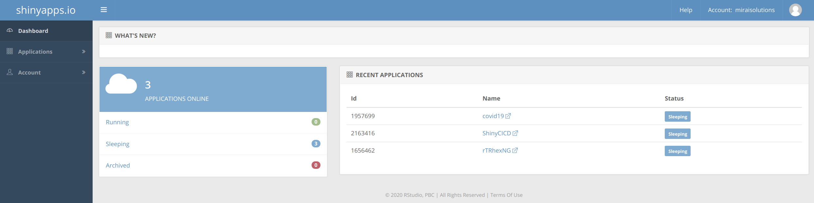

```{r setup, include=FALSE}
options(htmltools.dir.version = FALSE)
```

layout: true

<div class="my-footer"><span>Copyright (c) 2020</span></div> 

---



<br>

### Bring ideas to life.
### Smart. Agile. Personal.

```{r eval = TRUE, echo = FALSE, out.width = "50%", out.extra='style="position:absolute;bottom:100px;right:50px;"'}
knitr::include_graphics("./img/mirai-solutions-logo-flyer.png")
```

---

## Workshop Overview

- Fork the starting point package and Shiny app
- Version control
- Automating controls on Travis CI
- **Break**
- Gitflow
- Agile development
- Pull requests and branches control
- Deploymnet on shinyapps.io
- **Break**
- GitHub Actions
- Automatic Deployment
- Release
- Conclusions

---

class: inverse center middle
## The XXX Shiny app

---

## Shiny app
Our starting point is the XXX Shiny app that has been built in the workshop "Is R ready for Production? Let’s develop a Professional Shiny Application!"

SUMMARY OF VANLOG's WORKSHOP APP FEATURES

It is a simple, production-ready package available on GitHub that you can [fork](https://help.github.com/en/github/getting-started-with-github/fork-a-repo). No need to have attended the other workshop for this.

---

## How to Fork

.pull-left[
A fork is a copy of a repository. Forking a repository allows you to freely experiment with changes without affecting the original project.

LINK TO THE FORK BUTTON IN THE CORRECT REPO

Instructions to make a [fork](https://help.github.com/en/github/getting-started-with-github/fork-a-repo) on GitHub.
]

.pull-right[
```{r eval = TRUE, echo = FALSE, out.width = "30%", out.extra='style="position:absolute;"'}

```
]

---

## Project Structure

.inverse-left-column[
The project is a Shiny app structured as a package. A simple development workflow to package a Shiny app is provided by the [`golem` package](https://cran.r-project.org/web/packages/golem/index.html).
]

.inverse-right-column[
.pull-middle[
```{r eval = TRUE, echo = FALSE, out.width = "50%"}
knitr::include_graphics("./img/golem.png")
```
]
]

&nbsp;
&nbsp;
&nbsp;

It is good practice to integrate a Shiny app in a package, as then one can take full advantage of all the integrated features already established for an R package (e.g. automatic testing, `R CMD checks`, etc.).

A packaged Shiny app can also take advantage of:

- Continuous Integration (CI) pipelines to automate checks and ensure higher code quality and robustness;
- Continuous Deployment (CD) pipelines to automate the process of deployment to a productive environment.

---

## Review: Package Structure

*"In R, the fundamental unit of shareable code is the package. A package bundles together code, data, documentation, and tests, and is easy to share with others."*, [Introduction to R packages by Hadley Wickham](http://r-pkgs.had.co.nz/intro.html)

Such a structure gives us some useful functionalities, such as unit testing and documentation.
Moreover we can rely on  built-in features to automatically check the code (`R CMD Check`).

```{r eval = TRUE, echo = FALSE, out.width = "80%", out.extra='style="position:absolute;bottom:100px;right:50px;"'}
knitr::include_graphics("./img/package_structure.png")
```

---

## Production Ready

Being **Production Ready** means that the product-building process is an automated, streamlined pipeline, optimized for speed of delivery to the end-user.

By automating building and testing processes, the pipeline to production ensures:

.pull-left[

- Security  
- Quality  
- Stability  

&nbsp;

**Production is not a fixed object, but a continuous improvement cycle.**

PRACTICAL EXAMPLE: RUN R CMD CHECK TO DISCOVER SOMETHING INNOCUOUS IS BROKEN (e.g. INCOMPLETE DOCUMENTATION) AND THEY NEED TO FIX THIS.
]

.pull-right[
```{r eval = TRUE, echo = FALSE, out.width = "35%", out.extra='style="position:absolute;bottom:60px;right:50px;"'}
knitr::include_graphics("./img/devCycle.001.png")
```
]

---

## Best Practices

- Modularize your code. (functions and package structure in R)
- Have your building blocks general and flexible.
- Make your code robust with automated testing.
- Trace your work with a version control system

```{r eval = TRUE, echo = FALSE, out.width = "50%", out.extra='style="position:absolute;bottom:60px;right:50px;"'}
knitr::include_graphics("./img/best_practices.001.png")
```

---

## Version Control

A project under version control records changes over time so that a specific version of the project can be recalled at a later point in time. 

.pull-left[
Usually changes are not tracked just locally, but on a server to ensure against local failures and to integrate the track changes of multiple developers.

A version control system is the starting point for collaborative work.
]

.pull-right[
```{r eval = TRUE, echo = FALSE, out.width = "40%", out.extra='style="position:absolute;bottom:120px;right:70px;"'}
knitr::include_graphics("./img/version-control.001.png")
```
]


---

## Git

Git is a very common, free and open source version control system, designed to be very efficient and to support distributed, non-linear workflows.

[git documentation](https://git-scm.com/doc)

- [`git commit`](https://git-scm.com/docs/git-commit): Records changes to the repository

- [`git push`](https://git-scm.com/docs/git-push): Updates remote refs using local refs.

- [`git pull`](https://git-scm.com/docs/git-pull): Incorporates changes from a remote repository into the current branch. 

```{r eval = TRUE, echo = FALSE, out.width = "80%", out.extra='style="position:absolute;bottom:50px;right:50px;"'}
knitr::include_graphics("./img/git.png")
```

---

## Automating Controls

Continuous Integration (CI) is the practice of automatically merging current development work to a shared mainline, also multiple time a day. 

Automating the checks means not having to relay on people applying best practices, e.g. running `R CDM Check`, before committing.

LIVE: MAKE AN EXAMPLE THAT LOOKS INNOCUOUS BUT FAILS TO SHOW THAT ONE DOES NOT WANT TO RELY ON PEOPLE RUNNING CHECKS MANUALLY BEFORE COMMITTING.

```{r eval = TRUE, echo = FALSE, out.width = "60%", out.extra='style="position:absolute;bottom:50px;right:50px;"'}

```

---

## Travis CI

.inverse-left-column[
[Travis CI](https://travis-ci.com/) is an open-source hosted continuous integration service that can be used to build and test software projects hosted on GitHub.
]

.inverse-right-column[
.pull-middle[
```{r eval = TRUE, echo = FALSE, out.width = "50%"}
knitr::include_graphics("./img/TravisCI.png")
```
]
]

`usethis::use_travis(ext = "com")` creates a Travis CI configuration file (`.travis.yml`)

```{yaml, eval = FALSE}
language: r
cache: packages
```

GitHub notifies Travis CI of the occurrence of new commits / pull requests, triggering actions on Travis CI as specified in .travis.yml

A badge indicating the CI status can be integrated in the `README.md`. INCLUDE HTML OF THE SHINY APP BADGE

[](https://travis-ci.com/miraisolutions/ShinyCICD)

---

class: inverse center middle
# Break

---

## Gitflow

.pull-left[
[Gitflow](https://nvie.com/posts/a-successful-git-branching-model/) is a standard setup that allows a collaborative development, while assuring the safety of the released product.

According to the Gitflow approach, the central repo holds two main branches with an infinite lifetime:

- `master`: reflects a production-ready state.
- `develop`: reflects a state with the latest delivered developments for the next release.

Each feature branch provides an additional incremental value to the product, potentially ready for deployment. ]

.pull-right[
```{r eval = TRUE, echo = FALSE, out.width = "90%", fig.cap='https://nvie.com/posts/a-successful-git-branching-model/'}
knitr::include_graphics("./img/gitflow.png")
```
]

---

## Issues, Projects and Pull Requests

New development items are usually recorded on GitHub as [Issues](https://help.github.com/en/github/managing-your-work-on-github/creating-an-issue).

Issues can be managed via visual boards by creating a [project](https://help.github.com/en/github/managing-your-work-on-github/about-project-boards) on GitHub.

The deveopment associated with each issue should, in principle, occurr in a separate `feature` [branch](https://help.github.com/en/github/collaborating-with-issues-and-pull-requests/creating-and-deleting-branches-within-your-repository), for the separation of concerns between different developments. 

Once the development is concluded it can be integrated back in the main development branch via [pull request](https://help.github.com/en/github/collaborating-with-issues-and-pull-requests/about-pull-requests).

LIVE: FIX ISSUR ON A BRANCH --> MAKE PULL REQUEST TO MERGE THIS INTO THE MAIN BRANCH

```{r eval = TRUE, echo = FALSE, out.width = "80%", out.extra='style="position:absolute;bottom:60px;right:50px;"'}
knitr::include_graphics("./img/project-board.png")
```

---

## Agile Development

Gitflow fits well with all Agile frameworks: at each development cycle a set of Issues is worked on according to prioritization. At the end of each development cycle it is possible to perform a release and have a development increment onto production. Each feature can be inspected and feedback can be given before its release, keeping the final product always up to date with the end user needs.

```{r eval = TRUE, echo = FALSE, out.width = "65%", out.extra='style="position:absolute;bottom:40px;right:50px;"'}
knitr::include_graphics("./img/agile_dev.001.png")
```

---

## Pull Requests and Branches Control

It is important that the code is checked before it is merged back into the main development to ensure robustness and stability of the code. This can be ensured by [setting restrictions on branches](https://help.github.com/en/github/administering-a-repository/enabling-branch-restrictions):

- [request a reviewer on each pull request](https://help.github.com/en/github/collaborating-with-issues-and-pull-requests/requesting-a-pull-request-review)
- [require an automatic status check](https://help.github.com/en/github/administering-a-repository/about-required-status-checks) (e.g. Travis CI) before merging to `master` or `develop`.

LIVE SHOW HOW TO SET BRENCHES CONTROLS
LIVE SHOW CHECKS PASSING BEFORE MERGING.

```{r eval = TRUE, echo = FALSE, out.width = "50%", out.extra='style="position:absolute;bottom:60px;right:50px;"'}
knitr::include_graphics("./img/branches-control.001.png")
```

---

## Deployment shinyapps.io

Our productive environment is going to be [shinyapps.io](https://www.shinyapps.io/), a platform to host Shiny apps and share them on the web. The service runs in the cloud on shared servers operated by RStudio.

[Setup a shinyapp.io account](https://docs.rstudio.com/shinyapps.io/getting-started.html#CreateAccount)

[Deployment of an application from RStudio](https://docs.rstudio.com/shinyapps.io/getting-started.html#deploying-a-sample-application)

LIVE: MANUAL DEPLOYMENT → CHECK ALL WORKS

```{r eval = TRUE, echo = FALSE, out.width = "80%", out.extra='style="position:absolute;bottom:100px;right:50px;"'}

```

---

class: inverse center middle
# Break

---

## GitHub Actions

.inverse-left-column[
[GitHub Actions](https://help.github.com/en/actions) is a service for completely customizable, GitHub integrated workflow, including CI and CD executions.

[Workflows](https://help.github.com/en/actions/configuring-and-managing-workflows/configuring-a-workflow) use `YAML` syntax and should be stored in the `.github/workflows` directory in the root of the repository.
]

.inverse-right-column[
.pull-middle[
```{r eval = TRUE, echo = FALSE, out.width = "60%"}
knitr::include_graphics("./img/github-actions.png")
```
]
]

&nbsp;
&nbsp;
&nbsp;

Workflows are constituted of jobs and each job is a set of steps to perform individual tasks, e.g. commands or actions.

Compared to Travis CI, in GitHub Actions each step needs to be explicitly specified. Moreover, for the time being, GitHub Actions does not support a hierarchical, aggregated structure of actions.

---

## Generic CI/CD Pipeline

Generally speaking, a CI pipleline for an R package is comprised of the following steps:

- define system environment
- install R
- chaching system environment
- check out the package
- install package dependencies
- chaching dependencies
- install package
- run checks
- caching build
- deploy

---

## CI Workflow in GitHub Actions - check out the package

The workflow runs upon push commands and pull requests on the `master` branch, which is the default. It uses the predefined and built in action `checkout@v2` to check out the R package.

```{yaml, eval = F}
# Check on push and pull requests to master
on: [push, pull_request]

# Name of the workflow
name: CI

jobs:
  CI:
    runs-on: ubuntu-latest
    steps:

      - uses: actions/checkout@v2

      - uses: r-lib/actions/setup-r@master
```

---

## CI Workflow in GitHub Actions - manage dependencies

To install an R package we should first take care of its dependencies. This means checking them out and making sure they are cached for future builds.

```{yaml, eval = F}
# Query and cache R package dependencies
- name: Query dependencies
  run: |
  install.packages("remotes")
  saveRDS(remotes::dev_package_deps(dependencies = TRUE), 
          "depends.Rds", version = 2)
  shell: Rscript {0}
- name: Cache R packages
  uses: actions/cache@v1
  with:
    path: ${{ env.R_LIBS_USER }}
    key: ${{ runner.os }}-r-${{ hashFiles('depends.Rds') }}
    restore-keys: ${{ runner.os }}-r-
```

---

## CI Workflow in GitHub Actions - install the package

Then the package can be installed

```{yaml, eval = F}

- name: Install dependencies
  run: |
  remotes::install_deps(dependencies = TRUE)
  shell: Rscript {0}
```

---

## CI Workflow in GitHub Actions - run automatic checks

To run automatic checks it is necessary to explicitely request to run `rcmdcheck::rcmdcheck`, therefore we should make sure that the package is available.

```{yaml, eval = F}
- name: Install rcmdcheck
  run: |
    remotes::install_cran(c("rcmdcheck"))
  shell: Rscript {0}

- name: Check package
  run: rcmdcheck::rcmdcheck(args = "--no-manual", 
                            error_on = "warning", check_dir = "check")
  shell: Rscript {0}
```


LIVE: LINK TO TECHGUIDES

---

## DevOps

.pull-left[
**Goals**
- Achieve faster time to production
- Enable more frequent deployments
- Lower failure rate of new releases
- Shorten lead time between fixes
- Enhance collaboration between groups
]

.pull-right[
**Challenges**
- Mindset and Culture
- Security
- Responsibility
]


```{r eval = TRUE, echo = FALSE, out.width = "50%", out.extra='style="position:absolute;bottom:50px;right:50px;"'}
knitr::include_graphics("./img/devops.001.png")
```

---

## DevOps - Benefits

- Development via small work items increases the speed of development and improves its quality.
- Slow, repetitive and human made actions are error-prone. Automation in testing and deployment increases the stability of the production process.
- Version controlled development ensures traceability and repeatability of the development.
- Collaboration and an agile approach are keys to a functional production pipeline.
- Building, testing and deploying discrete development components improve confidence in the final product.

<br>

.pull-middle[
**DevOps is a culture. Tools can enable it.**

<br>

.fontsize08[
Note:
Infrastructure can also follow a continuous delivery philosophy (Infrastructure as Code).
]

]

---

## Automatic Deployment

Part of DevOps is to streamline the deployment process. 
Adding the deployment is another step in a `CI-CD` job. 
Notice that deployment to [shinyapps.io](https://www.shinyapps.io/) requires the package `rsconnect`, so it is necessary to install it explicitely.

```{yaml, eval = F}
      - name: Install dependencies
        run: |
          remotes::install_cran(c("rsconnect"))
        shell: Rscript {0}
        
      - name: Deploy to shinyapps.io
        if: github.ref == 'refs/heads/master'
        env:
          SHINYAPPS_ACCOUNT: ${{ secrets.SHINYAPPS_ACCOUNT }}
          SHINYAPPS_TOKEN: ${{ secrets.SHINYAPPS_TOKEN }}
          SHINYAPPS_SECRET: ${{ secrets.SHINYAPPS_SECRET }}
        run: |
          account_info <- lapply(paste0("SHINYAPPS_", 
                                c("ACCOUNT", "TOKEN", "SECRET")), 
                                Sys.getenv)
          do.call(rsconnect::setAccountInfo, account_info)
          rsconnect::deployApp(appName = "ShinyCICD")
        shell: Rscript {0}
```

---

## Tokens & Secrets

The variables `SHINYAPPS_ACCOUNT`, `SHINYAPPS_TOKEN` and `SHINYAPPS_SECRET` are tokens defined on [shinyapps.io](https://www.shinyapps.io/) and stored on GitHub Actions as [secrets](https://help.github.com/en/actions/configuring-and-managing-workflows/using-variables-and-secrets-in-a-workflow).

```{r eval = TRUE, echo = FALSE, out.width = "100%"}
knitr::include_graphics("./img/shinyapps.io.tokens.png")
```

---

## Automatic Deployment with Travis CI

Equivalently, automated deployment can be integrated on Travis CI. We leave this to you as an exercise.

You can have a look at our techguides for support.

<iframe src="https://mirai-solutions.ch/techguides/" width="100%" height="50%" frameBorder="0"></iframe>

---

## Release

A [Release](https://help.github.com/en/github/administering-a-repository/releasing-projects-on-github) is the deployment to production of a specific chunck of development. Each new release determines a new version (minor or major) of the software.

According to the Gitflow approach, no work should be pushed directly to `master`, which is updated as part of a release with a pull request from a stable `develop` branch or a `release` branch.

```{r eval = TRUE, echo = FALSE, out.width = "20%", out.extra='style="position:absolute;bottom:100px;right:70px;"'}
knitr::include_graphics("./img/release.001.png")
```

---

## How to Do a Release 1

- Create a release branch (e.g. `release/v2.0.0`) from `develop`.

- Consolidate the changelog (`NEWS.md` in R, see e.g. [recommendations](http://r-pkgs.had.co.nz/release.html#important-files) and [style guide](https://style.tidyverse.org/news.html#news-release)).

Example

```{r, eval=FALSE}
1.0.0 release preps
- Closes #XYZ Updated report.
```

- Update package version (NEWS.md and DESCRIPTION files in R).

- Create and merge a new pull request release/v2.0.0 →  master,  where the `closes XXX` are in the pull request comment.

---

## How to Do a Release 2

- Create a new release tag on master (on [GitHub Code > releases > Draft new release](https://github.com/miraisolutions/SmaRP/releases/new)).
  - Tag version: v1.0.1
  - Release title: packagename 1.0.1
  - Body: Paste as comment the list of changes in `NEWS.md`
  - Click on "Publish release"

- Create a new pull request and merge release/v2.0.0  →  develop

- Prepare for next version on develop (by changing the version NEWS.md and DESCRIPTION files).

---

## Conclusions

Our final product is a packaged shiny app ready for production, with automatic CI / CD pipelines in place.

REPLACE LINK TO FINAL PRODUCT

<iframe src="https://mirai-solutions.ch/techguides/" width="100%" height="50%" frameBorder="0"></iframe>

---

## Next Steps

Next Steps, technical info → close workshop

---

## Get in Touch


**Other Services by Mirai solutions:**

- Training customized to your business case - technical and agile topics
- Data Analytics & Software development: from your needs to a functional implementation
- Infrastructure design, managment and maintenace

**Get in touch:**
- LinkedIn https://www.linkedin.com/company/mirai-solutions-gmbh/
- email info@mirai-solutions.com
- website www.mirai-solutions.com

```{r eval = TRUE, echo = FALSE, out.width = "40%", out.extra='style="position:absolute;bottom:80px;right:50px;"'}
knitr::include_graphics("./img/mirai-solutions-logo-flyer.png")
```

---

class: inverse center middle
# Thank you!

