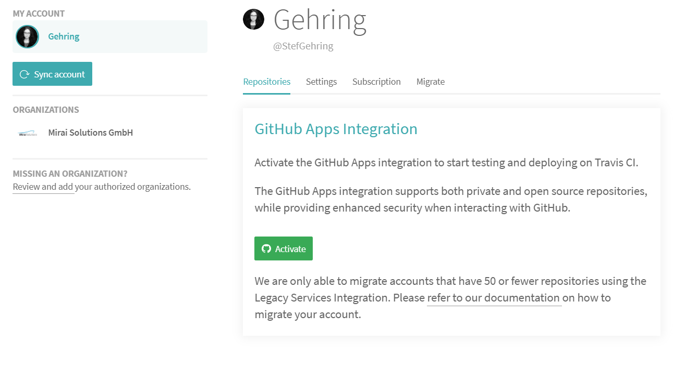
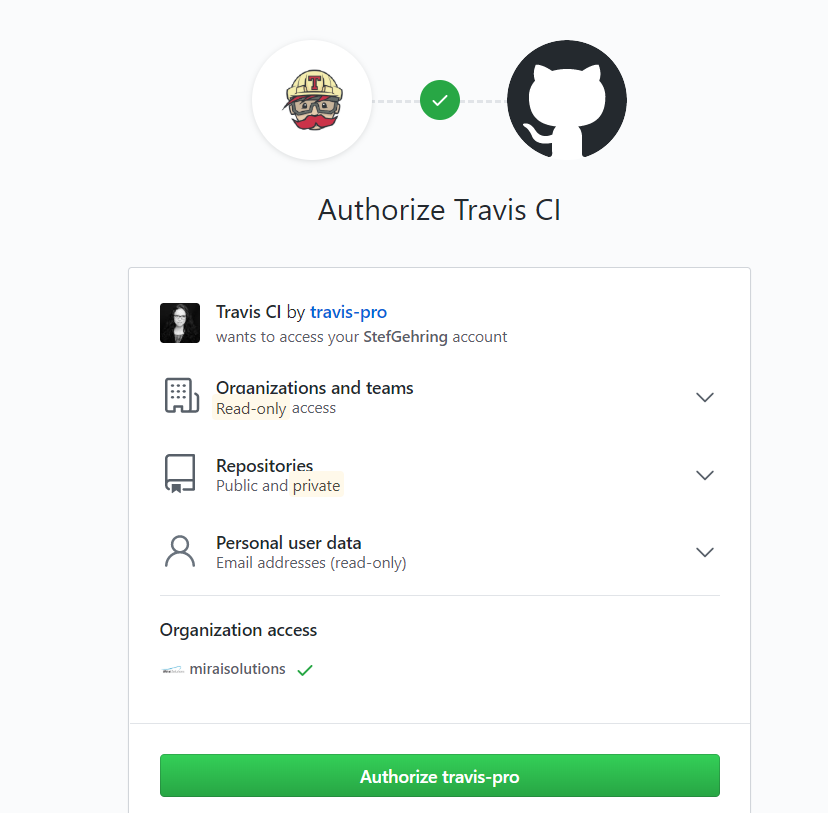

```{r setup, include=FALSE}
options(htmltools.dir.version = FALSE)
knitr::opts_chunk$set(eval = FALSE)
with_excluded <- FALSE
```

layout: true

<div class="my-footer"><span>Copyright (c) 2020</span></div> 

---


- Interdisciplinary team of data scientists, software engineers and IT architects
- Specialist knowledge ranging from finance, risk management and actuarial knowledge to math / stats techniques
- 100+ years of cumulative professional experience in financial services / insurance, software engineering, and professional training

### Bringing ideas to life.
### Smart. Agile. Personal.

```{r eval = TRUE, echo = FALSE, out.width = "50%", out.extra='style="position:absolute;bottom:100px;right:50px;"'}
knitr::include_graphics("./img/mirai-solutions-logo-flyer.png")
```

---

## Mirai Solutions

- Involved in organizing e-Rum2020
- Eager contributors to open source projects

```{r eval = TRUE, echo = FALSE, out.width = "50%", out.extra='style="position:absolute;bottom:80px;right:100px;"'}
knitr::include_graphics("./img/sticker-pyramid.png")
```

---

## Your Miraiers for the day

.pull-left[
### Riccardo
- Senior Solutions Consultant
- Computer Science / Automatic Control Engineer by education
- Academia :: Matlab => Mirai :: R (and more)
- R enthusiast since then
- Analytics in enterprise environments
- Open source projects
]

.pull-right[
### Peter
- Solutions Consultant
- Environmental scientist by education
- Using R since many years,
  first for statistics, now lots more
- Analytics in enterprise environments
- Passionate about machine and deep learning
]

--

.center[
#### With VanLog's support: 
### Andrea Melloncelli
]


---

## Workshop overview

.pull-left[
- Working example: packaged Shiny app on GitHub
- Automated checks on Travis CI
- **Break**
- GitFlow, branch control and pull requests
- Agile approach and release
- Setup shinyapps.io for deployment
- **Break**
- GitHub Actions workflows
- Continuous Deployment
- More full-cycle playground 
]

--

.pull-right[

- (Meant to be) **loosely-coupled**

- **Hands-on**

  - First: Observe, learn, understand
  - Then: Do!

- Concepts and principles not tailored to Shiny apps and specific tools / services

]


---

## Workshop prerequisites

- A GitHub account is necessary for the workshop: also make sure you have its password at hand

- Git must be installed on your computer

- A recent version of RStudio (>= 1.2) is recommended

- R installation: R >= 3.6.x, ideally R 4.0.x

- Packages pre-installation: 
  - https://github.com/miraisolutions/eRum2020Workshop-prereqs#readme

- Optional Git-related tools

  - [compareWith](https://github.com/miraisolutions/compareWith#readme) R package
  - [Sublime Merge](https://www.sublimemerge.com)


---

## (Shiny) App development cycle

Target "Production": deployed and made accessible

.pull-right[
```{r eval = TRUE, echo = FALSE, out.width = "35%", out.extra='style="position:absolute;top:60px;right:50px;"'}
knitr::include_graphics("./img/devCycle.001.png")
```
]


- Development (app code)
- ...
- Deployed app (today: shinyapps.io)

Fill the dots:
- Safety checks and controls
- Collaboration and planning
- Automate!

### Head start: Morning workshop "_Is R ready for Production? Let’s develop a Professional Shiny Application!_"

---

## Head start: Packaged Shiny app on GitHub

Shiny app developed as **R package**

- Best place for R functions to live in => modularization
- Documentation, namespaces / dependencies, tests, sanity checks, controls, ...
- Package [`golem`](https://thinkr-open.github.io/golem) providing development framework<br/>
  `golem` : Shiny app = `devtools` : R package
- Package dependencies explicitly tracked using [`renv`](https://rstudio.github.io/renv)
- Run the app: install the package and call a function!

**Production readiness**

- How to ensure it is maintained, regularly checked and ensured?
- How to control what is deployed to "production" (the live app)?
- Automated, streamlined pipelines
   
   - Security, Quality, Stability  
   - Optimized for speed of delivery

---

## Version control - Git(Hub)

.pull-left[

- Git is a popular, free and open source version control system designed to be very efficient and to support distributed, non-linear workflows. 
- With GitHub remote hosting, it is the _de facto_ standard for open source (R) projects
- Track changes
- History
- Share and Collaborate
]

.pull-right[
- Pull ([`git pull`](https://git-scm.com/docs/git-pull)): Incorporate changes from a remote repository into the current local branch
- Stage ([`git add`](https://git-scm.com/docs/git-commit)) changes: Prepare the content for the next commit
- Commit ([`git commit`](https://git-scm.com/docs/git-commit)): Record staged changes to the current branch
- Push ([`git push`](https://git-scm.com/docs/git-push)): Update remote repository using the local branch
]

Resources

- [Git documentation](https://git-scm.com/doc)
- [Happy Git and GitHub for the useR](https://happygitwithr.com/), Jenny Bryan, Jim Hester
- [Git and GitHub](http://r-pkgs.had.co.nz/git.html), R packages, Hadley Wickham

---

## Running example

- (The app developed during the morning workshop)
- A somewhat **minimal example** of a Shiny app showcasing the same production-readiness approach

   - GitHub repo https://github.com/miraisolutions/ShinyCICD-min
   - Create your own copy of the repo by [forking](https://github.com/miraisolutions/ShinyCICD/fork) it to your GitHub user account.

**_Clone_** locally your forked repo (https://github.com/&lt;user&gt;/ShinyCICD-min) as a **new RStudio project**.

```
File > New Project... > Version Control > Git
```

---

## `renv` dependencies

The project is based on [`renv`](https://rstudio.github.io/renv)

- Project-specific dependencies are tracked via an `renv.lock` file (+ `.Rprofile` and `renv/`)
- Ensure the set of dependencies is collaboratively shared an maintained (and can be used to align production deployments)
- When you open the project (and a new R session starts), `renv` detects the project dependencies are out of sync
  ```{r}
  renv::status()
  renv::restore()
  ```

--

**Note**: if you are on R 3.6.x, you will see a warning `Project requested R version '4.0.z' but '3.6.x' is currently being used`. No big deal, simply align the R version in the lockfile via
```r
renv::snapshot()
```
What changes (check the Git pane)? Should you commit the modifications?

---

## Install the package, run the app!

RStudio's Build Pane

- Install and Restart (Ctrl+Shift+B)

Then, launching the app is just about calling a function from the package:

```{r}
shinyCICD::run_app()
```

Easy, isn't it?

- Dependencies under control (esp. with distributed users)
- No need to source the app code (once the package is installed, the source package code does not even matter!)

Speed up in a development workflow

- `devtools::load_all()` (Ctrl+Shift+L): mimics the full-install, but is much quicker

    - `install.packages("devtools")`

- `golem::document_and_reload()` includes a few extras (`help()`)

---

## R's package check suite

- `R CMD check` built into R, conveniently accessed via 
    - ```{r}
       devtools::check()
       ```
    - ```{r}
      rcmdcheck::rcmdcheck()
      ```
    - RStudio: `Build Pane` > `Check`

Everything should be fine. 

- If the check get stuck, it might be due to issues with `renv` (mainly on Windows).

- In case, fall-back on `renv`-free setup and still follow the rest of the workshop

    - `renv::deactivate()`
    - delete `renv.lock` and the `renv` folder.

---

## Automated checks on Travis CI

[Travis CI](https://travis-ci.com/)

- Open-source hosted continuous integration service
- Automate package-level checks for continuous integration, triggered upon any push event (and pull requests) on the GitHub repo.

- Login at https://travis-ci.com/ (using your GitHub account)
- Activate authorization via GitHub Apps integration.

.center[
```{r eval = TRUE, echo = FALSE, out.width = "450px", out.extra = 'style="position: relative;"'}

```
```{r eval = TRUE, echo = FALSE, out.width = "250px", out.extra = 'style="position: relative;"'}
knitr::include_graphics("./img/TravisInstall.png")
```
```{r eval = TRUE, echo = FALSE, out.width = "250px", out.extra = 'style="position: relative;"'}

```
]

---

## Automated checks on Travis CI

- Setup Travis for your project 
  ```{r}
  usethis::use_travis() # ext = "com" for usethis < 1.6.0
  ```
- This will bring you to https://travis-ci.com/account/repositories, from where you can "Manage repositories on GitHub" to make sure Travis CI has access to your repo
- Look at the R console and the Git diffs (**don't commit changes yet**)

  - which files were changed by `usethis::use_travis()`? 

--

Travis has a default pipeline for R (https://docs.travis-ci.com/user/languages/r).

Align R _major_._minor_ version to the project setup (spaces matter!)
```yaml
r:
  - 4.0 # or 3.6
```
Use `renv` to restore dependencies:
- `cache` and `install` field as in the [Using renv with Continuous Integration](https://rstudio.github.io/renv/articles/ci.html#travis-ci) vignette.

---

## Automated checks on Travis CI

```yml
language: R
r:
  - 4.0 # or 3.6
cache:
  directories:
  - $HOME/.local/share/renv
  - $TRAVIS_BUILD_DIR/renv/library
install:
  - Rscript -e "if (!requireNamespace('renv', quietly = TRUE)) install.packages('renv')"
  - Rscript -e "renv::restore()"

```

**Commit & push** all changes

- This will trigger the first run on Travis, which can take >~10 minutes
  - caching will speed up future builds

- Go to the GitHub repo (`usethis::browse_github()`)
  - Do you find any indication of the CI status for the commit?
  - Scroll through the Travis log


---

## GitFlow

.pull-left[
[GitFlow](https://nvie.com/posts/a-successful-git-branching-model/) is a popular and successful branching model that enable collaborative, controlled development and releasese, assuring the safety and quality of the released product.

According to the GitFlow approach, the central repo holds two main branches with an infinite lifetime:

- `master`: reflects a production-ready state.
- `develop`: reflects a state with the latest delivered developments for the next release.

In addition

- `feature/`, `release/`, `hotfix/` branches

<sup>[https://nvie.com/posts/a-successful-git-branching-model]</sup>

]


```{r eval = TRUE, echo = FALSE, out.width = "35%", out.extra='style="position: absolute; right: 100px; top: 60px;"'}
knitr::include_graphics("./img/gitflow.png")
```


---

## Pull Requests and Branches Control

It is important that the code is checked before it is merged back into the main development / release line, to ensure robustness and stability of the code. This can be ensured by [setting restrictions on branches](https://help.github.com/en/github/administering-a-repository/enabling-branch-restrictions):

- Setting > Branches
- `develop` becomes the default branch
- Branch protection for `master` and `develop`
  - Commits are pushed only via pull requests
  -[require an automatic status check](https://help.github.com/en/github/administering-a-repository/about-required-status-checks) (e.g. Travis CI) before merging .
- [Require status checks to pass before merging ](https://help.github.com/en/github/collaborating-with-issues-and-pull-requests/requesting-a-pull-request-review)

.center[
```{r eval = TRUE, echo = FALSE, out.width = "70%"}
knitr::include_graphics("./img/branches-control.001.png")
```
]
---

## Issues, Projects and Pull Requests

Track development items as GitHub [Issues](https://help.github.com/en/github/managing-your-work-on-github/creating-an-issue) and [Projects](https://help.github.com/en/github/managing-your-work-on-github/about-project-boards) (visual boards)

- **NOTE** for forked repos, Issues / Projects are typically disabled by default => Repository **Settings**

GitFlow

- `feature/` branches for devloping indivudal issues in isolation
- Development reviewed and safely integrated into `develop` via [pull request](https://help.github.com/en/github/collaborating-with-issues-and-pull-requests/about-pull-requests).

.center[
```{r eval = TRUE, echo = FALSE, out.width = "80%"}
knitr::include_graphics("./img/project-board.png")
```
]
---

## Agile Development

GitFlow fits well with all Agile frameworks: at each development cycle a set of Issues is worked on according to prioritization. At the end of each development cycle it is possible to perform a release and have a development increment onto production. Each feature can be inspected and feedback can be given before its release, keeping the final product always up to date with the end user needs.

.center[
```{r eval = TRUE, echo = FALSE, out.width = "63%"}
knitr::include_graphics("./img/agile_dev.001.png")
```
]
---

## Deployment: shinyapps.io

[shinyapps.io](https://www.shinyapps.io/) Shiny apps hosting service offered by RStudio.

- Login at https://www.shinyapps.io using your GitHub account
- [Configure rsconnect](https://docs.rstudio.com/shinyapps.io/getting-started.html#deploying-applications) and deploy your app from your local R installation

```{r}
golem::add_shinyappsio_file()
usethis::use_git_ignore("rsconnect")
install.packages(c("rsconnect", "pkgload"))
usethis::use_package("rsconnect", "Suggests")
renv::snapshot()
```

```{r}
rsconnect::setAccountInfo(...)
```

```{r}
rsconnect::deployApp(appName = "ShinyCICD", appFiles = setdiff(list.files(), "renv"))
```

```{r}
renv::snapshot()
```

---

## GitHub Actions

.inverse-left-column[
[GitHub Actions](https://help.github.com/en/actions) is a service for completely customizable, GitHub integrated workflow, including CI and CD executions.

[Workflows](https://help.github.com/en/actions/configuring-and-managing-workflows/configuring-a-workflow) use `YAML` syntax and should be stored in the `.github/workflows` directory in the root of the repository.
]

```{r}
usethis::use_build_ignore("deploy")
usethis::use_github_action(url = "https://raw.githubusercontent.com/riccardoporreca/ShinyCICD/final/.github/workflows/ci-cd.yml")

```

.inverse-right-column[
.pull-middle[
```{r eval = TRUE, echo = FALSE, out.width = "60%"}
knitr::include_graphics("./img/github-actions.png")
```
]
]

&nbsp;
&nbsp;
&nbsp;

Workflows are constituted of jobs and each job is a set of steps to perform individual tasks, e.g. commands or actions.

Compared to Travis CI, in GitHub Actions each step needs to be explicitly specified. Moreover, for the time being, GitHub Actions does not support a hierarchical, aggregated structure of actions.

---

## Tokens & Secrets

The variables `SHINYAPPS_ACCOUNT`, `SHINYAPPS_TOKEN` and `SHINYAPPS_SECRET` are tokens defined on [shinyapps.io](https://www.shinyapps.io/) and stored on GitHub Actions as [secrets](https://help.github.com/en/actions/configuring-and-managing-workflows/using-variables-and-secrets-in-a-workflow).

```{r eval = TRUE, echo = FALSE, out.width = "100%"}
knitr::include_graphics("./img/shinyapps.io.tokens.png")
```

---

## Release

A [Release](https://help.github.com/en/github/administering-a-repository/releasing-projects-on-github) is the deployment to production of a specific chunck of development. Each new release determines a new version (minor or major) of the software.

According to the GitFlow approach, no work should be pushed directly to `master`, which is updated as part of a release with a pull request from a stable `develop` branch or a `release` branch.

```{r eval = TRUE, echo = FALSE, out.width = "20%", out.extra='style="position:absolute;bottom:100px;right:70px;"'}
knitr::include_graphics("./img/release.001.png")
```

---

## How to Do a Release 1

- Create a release branch (e.g. `release/v2.0.0`) from `develop`.

- Consolidate the changelog (`NEWS.md` in R, see e.g. [recommendations](http://r-pkgs.had.co.nz/release.html#important-files) and [style guide](https://style.tidyverse.org/news.html#news-release)).

Example

```{r, eval=FALSE}
1.0.0 release preps
- Closes #XYZ Updated report.
```

- Update package version (NEWS.md and DESCRIPTION files in R).

- Create and merge a new pull request release/v2.0.0 →  master,  where the `closes XXX` are in the pull request comment.

---

## How to Do a Release 2

- Create a new release tag on master (on [GitHub Code > releases > Draft new release](https://github.com/miraisolutions/SmaRP/releases/new)).
  - Tag version: v1.0.1
  - Release title: packagename 1.0.1
  - Body: Paste as comment the list of changes in `NEWS.md`
  - Click on "Publish release"

- Create a new pull request and merge release/v2.0.0  →  develop

- Prepare for next version on develop (by changing the version NEWS.md and DESCRIPTION files).

---

---

## Get in Touch


**Other Services by Mirai solutions:**

- Training customized to your business case - technical and agile topics
- Data Analytics & Software development: from your needs to a functional implementation
- Infrastructure design, managment and maintenace

**Get in touch:**
- LinkedIn https://www.linkedin.com/company/mirai-solutions-gmbh/
- email info@mirai-solutions.com
- website https://mirai-solutions.ch

```{r eval = TRUE, echo = FALSE, out.width = "40%", out.extra='style="position:absolute;bottom:80px;right:50px;"'}
knitr::include_graphics("./img/mirai-solutions-logo-flyer.png")
```

---

class: inverse center middle
# Thank you!
